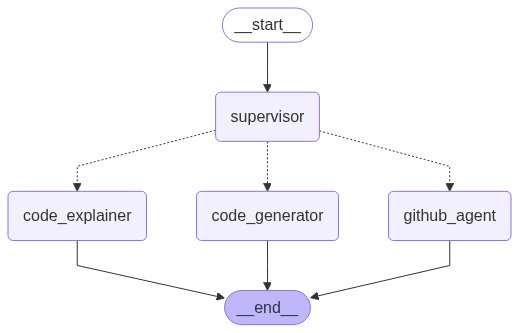

# Code Assistant AI

Code Assistant AI is an intelligent developer productivity tool that leverages multi-agent orchestration to enhance your coding workflow. This application helps developers understand, generate, and manage code more efficiently through automated assistance.



Note: the code generation currently is using Mistral Code VSCode plugin.

## Features

- **Code Understanding**: Analyze and explain code patterns, architecture, and functionality
- **Code Generation**: Create new features, optimize performance, and generate test cases
- **Developer Workflow Automation**: Automate GitHub operations like pull request creation
- **Context-Aware Suggestions**: Provide tailored recommendations based on your codebase
- **Documentation Generation**: Automatically generate code documentation

## Demo Scenarios

Demo script is [here](public/scripts/script.md)

The application demonstrates AI capabilities in several areas:

1. **Code Understanding**:
   - "What is my code style standard?"
   - "Explain how the moving average strategy works"
2. **Code Generation**:
   - Feature addition: "Add a new trading strategy to this system"
   - Performance optimization: "Optimize risk strategy parameters"
   - Testing: "Write tests for data loader"
3. **Developer Activities**: "Generate a pull request for issue 1 from test branch to main"
4. **Documentation**: "Generate documentation for this code"

## Architecture

The application is built with a multi-agent system:

- **Code Explainer Agent**: Analyzes and explains code functionality
- **Code Generator Agent**: Creates new code based on requirements
- **GitHub Agent**: Handles GitHub operations and workflows via Github MCP
- **Retrieval Agent**: Provides context-aware information retrieval

## Setup

1. Clone the repository:
   ```bash
   git clone {REPO_LINK}
   cd code-assistants
   ```

2. Install dependencies using uv:
   ```bash
   uv sync
   ```

3. Set up environment variables:
   - Copy `.env.example` to `.env` and configure your settings
   - Required environment variables:
     - `MISTRAL_API_KEY`: Your MistralAI API key
     - `HF_TOKEN`: Your Hugging Face token (optional)
     - `GITHUB_PERSONAL_ACCESS_TOKEN`: Your GitHub personal access token
     - `TOKENIZERS_PARALLELISM`: Set to `false` for better performance

4. Run the application:
   ```bash
   uv run -- chainlit run app.py
   ```

5. Access the web interface at `http://localhost:8000`

## Usage

1. Start the application and connect to the web interface
2. Input your code-related questions or commands
3. The AI agents will process your request and provide:
   - Code explanations
   - Generated code snippets
   - GitHub operation assistance
   - Documentation generation

## Testing

The project includes unit tests for the demo source code. Currently available tests:

- `test_risk_manager.py`: Tests risk management calculations and position sizing

Run the test suite to verify the functionality:

```bash
# Run all tests
uv run python -m unittest discover -s demo-source-code/tests

# Run tests with coverage
uv run coverage run -m unittest discover -s demo-source-code/tests

# View coverage report
uv run coverage report
```

You can add more test files to the `demo-source-code/tests/` directory to test other components of the system.

## Technology Stack

- **Backend**: Python 3.11+
- **Frontend**: Chainlit for web interface
- **AI Framework**: LangGraph for agent orchestration
- **Language Model**: MistralAI for code understanding and generation
- **Vector Store**: InMemoryVectorStore for codebase embedding and retrieval
- **Version Control**: GitHub integration for automated workflows
- **Package Management**: uv for modern Python dependency management

## Configuration

The application uses the following configuration:

- **AI Models**:
  - Development model: `devstral-small-2505`
  - Code generation model: `mistral-medium-latest`
  - Embedding model: `codestral-embed`
- **Source Code Directory**: `demo-source-code/` for code analysis

## Code Quality

The project uses pre-commit hooks to maintain code quality:

- **Ruff**: Linter and formatter for Python code
- **mypy**: Type checking
- **pre-commit-hooks**: Various quality checks (trailing whitespace, YAML validation, etc.)

Install pre-commit hooks:
```bash
uv tool install pre-commit
pre-commit install
```
